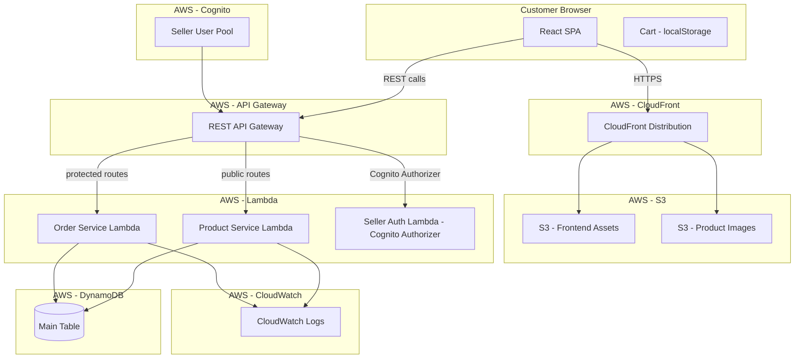

# Design Document

## Overview

The Baju Kurung E-Commerce MVP is a serverless web application that lets Indonesian customers browse and pre-order authentic Malaysian Baju Kurung without creating an account. Customers browse by occasion, select a size, add items to a client-side cart, and complete checkout by generating a pre-filled WhatsApp message sent directly to the Seller. The Seller manages orders through an authenticated dashboard.

The system is built entirely on AWS serverless services: Lambda, API Gateway, DynamoDB, S3, CloudFront, Cognito (Seller-only), and CloudWatch. The frontend is a static single-page application (SPA) hosted on S3 and distributed via CloudFront. All backend logic runs in Lambda functions exposed through API Gateway.

### Key Design Decisions

- **No customer auth**: Cart state lives entirely in the browser (localStorage). No session or token management for customers.
- **Single DynamoDB table**: Products and Orders share one table with prefixed keys (`PRODUCT#`, `ORDER#`) to support efficient access patterns and minimise operational overhead.
- **WhatsApp deep link**: Checkout calls `POST /orders` to create the order record, then generates a `https://wa.me/{sellerNumber}?text={urlEncodedMessage}` URL opened in a new tab. The order ID is included in the WhatsApp message so the Seller can reference it.
- **Pre-Order Window enforcement**: The API filters products by window dates server-side; the frontend also guards against adding expired items to the cart.
- **Separate staging/production environments**: Implemented as separate AWS accounts or CloudFormation stack namespaces.

---

## Architecture



### Request Flow — Customer Browsing

1. Browser loads SPA from CloudFront → S3.
2. SPA calls `GET /products?occasion=Raya` → API Gateway → Product Lambda.
3. Lambda queries DynamoDB for products with matching occasion and open Pre-Order Window.
4. Product images are served directly from CloudFront → S3 (pre-signed URLs or public CDN paths).

### Request Flow — WhatsApp Checkout

1. Customer fills in name and WhatsApp number, then clicks "Checkout".
2. SPA calls `POST /orders` (no auth required) with the customer name, customer WhatsApp number, and cart contents → API Gateway → Order Lambda.
3. Order Lambda creates an Order record in DynamoDB with status `PENDING` (including the customer's WhatsApp number) and returns the new `orderId`.
4. SPA formats a plain-text order intent message including the `orderId` for Seller reference using `generateOrderIntentLink()`.
5. SPA constructs `https://wa.me/{sellerNumber}?text={encoded}` and opens it in WhatsApp.
6. The Seller receives the WhatsApp message, looks up the order by `orderId` in the dashboard, and confirms it. If the customer never sends the message, the Seller can proactively follow up using the stored Customer WhatsApp number.

### Request Flow — Seller Dashboard

1. Seller logs in via Cognito hosted UI; receives JWT.
2. All dashboard API calls include `Authorization: Bearer {jwt}`.
3. API Gateway Cognito Authorizer validates the JWT before forwarding to Order Lambda.

---

## Components and Interfaces

### Frontend (React SPA)

| Component | Responsibility |
|---|---|
| `CataloguePage` | Lists products filtered by occasion and size |
| `ProductDetailPage` | Shows full product info, size chart, add-to-cart |
| `CartDrawer` | Displays cart items, totals, remove actions |
| `CheckoutModal` | Collects customer name and WhatsApp number, calls `POST /orders`, then calls `generateOrderIntentLink()` and opens WhatsApp |
| `SellerDashboard` | Order list, filters, status updates (auth-gated) |
| `AddProductForm` | Seller form to create a product — name, occasion, description, fabric, colours, sizes, size chart, price, images, Pre-Order Window |
| `SizeChartTable` | Renders standardised size/measurement table |
| `cartStore` | localStorage-backed cart state (Zustand or Context) |

### Backend Lambda Functions

#### Product Service Lambda

Handles all product endpoints. Read endpoints are public; write endpoints require Cognito JWT.

| Method | Path | Auth | Description |
|---|---|---|---|
| `GET` | `/products` | None | List products; supports `?occasion=`, `?size=` query params. Returns only products with open Pre-Order Window. |
| `GET` | `/products/{productId}` | None | Get single product detail including per-product size chart. |
| `POST` | `/products` | Seller JWT | Create a new product listing with images, size chart, and Pre-Order Window. |

#### Order Service Lambda

Handles order management. `POST /orders` is public (no auth); all other write endpoints require Cognito JWT.

| Method | Path | Auth | Description |
|---|---|---|---|
| `POST` | `/orders` | None | Create an order from the customer's cart at checkout. Returns the new `orderId`. |
| `GET` | `/orders` | Seller JWT | List all orders; supports `?status=` filter. |
| `PATCH` | `/orders/{orderId}` | Seller JWT | Transition order status. Required fields vary by target status (see state machine). Returns updated order + copyable WhatsApp message where applicable. |
| `GET` | `/orders/{orderId}` | Seller JWT | Get single order detail. |
| `POST` | `/orders/{orderId}/uploads` | Seller JWT | Get a pre-signed S3 URL for uploading proof photos (payment, receipt, refund). |

### WhatsApp Message Generators (frontend utilities)

Three pure functions generate WhatsApp messages at different stages of the order lifecycle.

#### 1. Customer Order Intent Message — generated at checkout (customer-facing)

```
generateOrderIntentLink(cart: CartItem[], customerName: string, orderId: string, sellerPhone: string): string
```

Returns a `wa.me` deep link opened in WhatsApp when the customer completes checkout. The message is sent **from the customer to the seller** to notify the seller of a new order and prompt them to confirm details and payment instructions.

Output format (Bahasa Indonesia):
```
Halo, saya {customerName} ingin memesan:

No. Pesanan: {orderId}

1. {productName} - Ukuran {size} x{qty} = Rp {lineTotal}
2. ...

Total: Rp {subtotal}

Mohon konfirmasi pesanan dan informasi pembayaran. Terima kasih!
```

#### 2. Order Summary Message — generated on transition to `PAYMENT_PENDING` (seller dashboard)

```
generateOrderSummaryMessage(order: Order): string
```

Displayed as a copyable text block in the Seller dashboard. The seller pastes this **from the seller to the customer** to confirm the finalised order details and provide payment instructions.

Output format (Bahasa Indonesia):
```
Halo {customerName}, berikut ringkasan pesanan Anda:

No. Pesanan: {orderId}

1. {productName} - Ukuran {size} x{qty} = Rp {lineTotal}
2. ...

Total: Rp {totalPriceIDR}

Silakan lakukan pembayaran dan konfirmasi kepada kami.
Terima kasih!
```

#### 3. Tracking Link Message — generated on transition to `SHIPPED` (seller dashboard)

```
generateTrackingMessage(order: Order): string
```

Displayed as a copyable text block in the Seller dashboard. The seller pastes this **from the seller to the customer** to share the shipment tracking link.

Output format (Bahasa Indonesia):
```
Halo {customerName}, pesanan Anda sudah dikirim!

No. Pesanan: {orderId}
Link Tracking: {trackingLink}

Terima kasih sudah berbelanja!
```
---

## Data Models

### DynamoDB Table Design

Single table: `baju-kurung-{env}`

All entities share the table. Entity type is encoded in the key prefix and an explicit `entityType` attribute.

#### Key Schema

| Attribute | Type | Description |
|---|---|---|
| `PK` | String | Partition key — e.g. `PRODUCT#<productId>`, `ORDER#<orderId>` |
| `SK` | String | Sort key — e.g. `METADATA`, `STATUS#<timestamp>` |

#### Global Secondary Indexes

| GSI | PK | SK | Purpose |
|---|---|---|---|
| `GSI1` | `occasion` | `preOrderWindowEnd` | Query products by occasion, filter by open window |
| `GSI2` | `entityType` | `createdAt` | List all orders sorted by creation date |
| `GSI3` | `status` | `createdAt` | Filter orders by status |

#### Product Item

```json
{
  "PK": "PRODUCT#<uuid>",
  "SK": "METADATA",
  "entityType": "PRODUCT",
  "productId": "<uuid>",
  "name": "Baju Kurung Moden Raya",
  "occasion": "Raya",
  "description": "...",
  "fabricType": "Cotton Silk",
  "colours": ["Dusty Rose", "Sage Green"],
  "availableSizes": ["XS", "S", "M", "L"],
  "sizeChart": {
    "XS": { "bust": "76–80", "waist": "60–64", "hip": "84–88" },
    "S":  { "bust": "81–85", "waist": "65–69", "hip": "89–93" },
    "M":  { "bust": "86–90", "waist": "70–74", "hip": "94–98" },
    "L":  { "bust": "91–96", "waist": "75–80", "hip": "99–104" }
  },
  "priceIDR": 450000,
  "primaryImageKey": "products/<uuid>/primary.jpg",
  "imageKeys": ["products/<uuid>/1.jpg", "products/<uuid>/2.jpg"],
  "preOrderWindowStart": "2025-01-01",
  "preOrderWindowEnd": "2025-03-31",
  "createdAt": "2025-01-01T00:00:00Z",
  "updatedAt": "2025-01-01T00:00:00Z"
}
```

`sizeChart` is a map keyed by Standard Size. Only sizes listed in `availableSizes` need entries. For `AllSize` products, the entry describes the general fit range (e.g. `"AllSize": { "bust": "86–96", "waist": "70–80", "hip": "94–104" }`). All measurement values are in centimetres.

#### Order Item

```json
{
  "PK": "ORDER#<uuid>",
  "SK": "METADATA",
  "entityType": "ORDER",
  "orderId": "<uuid>",
  "customerName": "Siti Rahayu",
  "customerWhatsApp": "+628123456789",
  "lineItems": [
    {
      "productId": "<uuid>",
      "productName": "Baju Kurung Moden Raya",
      "size": "M",
      "quantity": 2,
      "unitPriceIDR": 450000
    }
  ],
  "totalPriceIDR": 900000,
  "status": "PENDING",
  "trackingLink": null,
  "proofOfPaymentKey": null,
  "proofOfReceiptKey": null,
  "refundAmountIDR": null,
  "proofOfRefundKey": null,
  "createdAt": "2025-02-15T10:30:00Z",
  "updatedAt": "2025-02-15T10:30:00Z"
}
```

#### Order Status State Machine

| From | To | Required fields | Side effect |
|---|---|---|---|
| `PENDING` | `PAYMENT_PENDING` | Updated line items + totalPriceIDR (optional edit) | Generate order summary WhatsApp Copyable Message |
| `PAYMENT_PENDING` | `PACKAGED` | `proofOfPaymentKey` (S3 image upload) | — |
| `PACKAGED` | `READY_TO_SHIP` | — | — |
| `READY_TO_SHIP` | `SHIPPED` | `trackingLink` | Generate tracking link WhatsApp Copyable Message |
| `SHIPPED` | `DELIVERED` | — | `proofOfReceiptKey` optional |
| `PENDING` | `CANCELLED` | — | — |
| `PAYMENT_PENDING` | `CANCELLED` | — | — |
| `PACKAGED` | `REFUND` | `refundAmountIDR`, `proofOfRefundKey` | — |
| `SHIPPED` | `REFUND` | `refundAmountIDR`, `proofOfRefundKey` | — |
| `DELIVERED` | `REFUND` | `refundAmountIDR`, `proofOfRefundKey` | — |

All other transitions are invalid and return `400 INVALID_STATUS_TRANSITION`.

#### Order Status History Item

```json
{
  "PK": "ORDER#<uuid>",
  "SK": "STATUS#2025-02-16T08:00:00Z",
  "entityType": "ORDER_STATUS",
  "status": "Confirmed",
  "changedAt": "2025-02-16T08:00:00Z"
}
```

### Standard Size Labels (enum — static)

The valid Standard Size values are fixed at the application level:

```typescript
type StandardSize = "XS" | "S" | "M" | "L" | "XL" | "XXL" | "AllSize";
```

Measurement ranges are **not** globally fixed — each product defines its own `sizeChart` map at creation time. The Seller fills in bust/waist/hip ranges per size when adding a product.

### Frontend Cart Model (localStorage)

```typescript
interface CartItem {
  productId: string;
  productName: string;
  size: StandardSize;
  quantity: number;
  unitPriceIDR: number;
  preOrderWindowEnd: string; // ISO date — used to guard expired items
}

interface Cart {
  items: CartItem[];
}
```

---

## Correctness Properties

*A property is a characteristic or behavior that should hold true across all valid executions of a system — essentially, a formal statement about what the system should do. Properties serve as the bridge between human-readable specifications and machine-verifiable correctness guarantees.*

### Property 1: Catalogue filters by occasion and open Pre-Order Window

*For any* set of products with varying occasions and Pre-Order Window dates, querying the catalogue with a specific occasion and a known current date must return only products that (a) belong to that occasion and (b) have a Pre-Order Window that includes the current date (start ≤ today ≤ end).

**Validates: Requirements 1.2, 1.3**

---

### Property 2: Catalogue response contains all required fields

*For any* product returned in a catalogue listing response, the response object must contain: name, primaryImageKey, priceIDR, availableSizes, preOrderWindowStart, and preOrderWindowEnd.

**Validates: Requirements 1.4**

---

### Property 3: Size filter returns only matching products

*For any* valid StandardSize filter applied to the catalogue, every product in the response must include that size in its availableSizes array.

**Validates: Requirements 1.5**

---

### Property 4: Product detail response contains all required fields

*For any* product retrieved via the detail endpoint, the response must contain: name, imageKeys, description, fabricType, colours, availableSizes, sizeChart, priceIDR, preOrderWindowStart, and preOrderWindowEnd.

**Validates: Requirements 1.6, 2.2**

---

### Property 5: Per-product size chart covers all available sizes

*For any* product, the `sizeChart` map must contain an entry for every size listed in `availableSizes`, and each entry must include a non-empty bust range, waist range, and hip range.

**Validates: Requirements 2.2, 2.3, 0.4**

---

### Property 5b: Product creation round-trip preserves all fields

*For any* valid product creation payload (with name, occasion, availableSizes, sizeChart, priceIDR, preOrderWindowStart, preOrderWindowEnd), after `POST /products` succeeds, the stored product must contain all submitted fields unchanged.

**Validates: Requirements 0.2, 0.4**

---

### Property 6: Only available sizes are selectable for a product

*For any* product, the set of sizes presented as selectable in the UI must be exactly equal to the product's availableSizes set — no more, no less.

**Validates: Requirements 2.4**

---

### Property 7: Products with open Pre-Order Windows can be added to cart

*For any* product whose Pre-Order Window is currently open (start ≤ today ≤ end), the add-to-cart operation must succeed and the cart must contain the item with the correct productId, size, quantity, and unitPriceIDR.

**Validates: Requirements 3.2, 4.1**

---

### Property 8: Checkout creates an order that preserves cart contents

*For any* cart containing one or more items, a non-empty customer name, and a valid customer WhatsApp number, after `POST /orders` succeeds, the stored order must contain the same items, quantities, unit prices, and subtotal as the original cart, include the customer name and WhatsApp number, and the returned `orderId` must be a non-empty string.

**Validates: Requirements 3.4, 4.5, 4.9, 4.10**

---

### Property 9: Valid order status transitions succeed and update status

*For any* order in a given status, applying a valid next-status transition from the state machine (e.g. `PENDING` → `PAYMENT_PENDING`, `READY_TO_SHIP` → `SHIPPED`) with all required fields must result in the order's status being updated to the new value.

**Validates: Requirements 3.5**

---

### Property 9b: Invalid order status transitions are rejected

*For any* order in a given status, attempting a transition not listed in the state machine (e.g. `PENDING` → `SHIPPED`, `DELIVERED` → `PENDING`) must return a `400 INVALID_STATUS_TRANSITION` error and leave the order status unchanged.

**Validates: Requirements 5.10**

---

### Property 9c: Status transitions with missing required fields are rejected

*For any* status transition that requires additional fields (e.g. `PACKAGED` requires `proofOfPaymentKey`, `SHIPPED` requires `trackingLink`, `REFUND` requires `refundAmountIDR` and `proofOfRefundKey`), submitting the transition without those fields must return a `400 VALIDATION_ERROR` and leave the order status unchanged.

**Validates: Requirements 5.5, 5.6, 5.8**

---

### Property 10: Every status update produces a timestamped history record

*For any* order status update, a status history item must be created containing the new status value and a non-null ISO timestamp.

**Validates: Requirements 3.6, 5.5**

---

### Property 11: Cart subtotal equals sum of all line item totals

*For any* cart state (including after additions and removals), the displayed subtotal must equal the sum of (quantity × unitPriceIDR) for every item in the cart.

**Validates: Requirements 4.2, 4.3, 4.4**

---

### Property 12: Customer order intent message contains all required information

*For any* cart with at least one item, a non-empty customer name, and a valid `orderId`, the generated WhatsApp deep link must: (a) match the pattern `https://wa.me/{sellerPhone}?text={encoded}`, (b) contain the customer name in the decoded message, (c) contain the `orderId`, (d) contain each product name, size, quantity, and unit price, (e) contain the cart subtotal, and (f) include a prompt for the seller to confirm the order and provide payment details.

**Validates: Requirements 4.5, 4.6**

---

### Property 12b: Order summary copyable message contains all required fields

*For any* order in `PAYMENT_PENDING` status with at least one line item, the generated order summary message must contain the customer name, order ID, each line item (product name, size, quantity, line total), and the total price in IDR.

**Validates: Requirements 5.4**

---

### Property 12c: Tracking link copyable message contains all required fields

*For any* order in `SHIPPED` status with a non-empty tracking link, the generated tracking message must contain the customer name, order ID, and the tracking link.

**Validates: Requirements 5.6**

---

### Property 13: Order list response contains all required fields for every order

*For any* order stored in the system, the order list endpoint response must include for that order: orderId, status, customerName, customerWhatsApp, at least one line item with productName and size, quantity, and createdAt.

**Validates: Requirements 5.2**

---

### Property 14: Order status filter returns only matching orders

*For any* valid OrderStatus filter applied to the order list endpoint, every order in the response must have that exact status value.

**Validates: Requirements 5.3**

---

### Property 15: Order detail response contains all required fields

*For any* order retrieved via the detail endpoint, the response must contain: orderId, status, customerName, customerWhatsApp, lineItems (with productName, size, quantity, unitPriceIDR), totalPriceIDR, createdAt, and trackingNumber (which may be null).

**Validates: Requirements 5.7**

---

## Error Handling

### API Error Responses

All Lambda functions return consistent JSON error responses:

```json
{
  "error": {
    "code": "PRODUCT_NOT_FOUND",
    "message": "The requested product does not exist."
  }
}
```

| Scenario | HTTP Status | Error Code |
|---|---|---|
| Product not found | 404 | `PRODUCT_NOT_FOUND` |
| Pre-Order Window closed | 409 | `PREORDER_WINDOW_CLOSED` |
| Invalid size for product | 400 | `INVALID_SIZE` |
| Missing required field | 400 | `VALIDATION_ERROR` |
| Size chart missing entry for available size | 400 | `INCOMPLETE_SIZE_CHART` |
| Invalid status transition | 400 | `INVALID_STATUS_TRANSITION` |
| Unauthenticated Seller request | 401 | `UNAUTHORIZED` |
| Forbidden (wrong Seller) | 403 | `FORBIDDEN` |
| Internal Lambda error | 500 | `INTERNAL_ERROR` |

### Frontend Error Handling

| Scenario | Behaviour |
|---|---|
| Add to cart without size selected | Inline error message; cart unchanged |
| Add expired Pre-Order product | Toast notification; cart unchanged |
| Checkout with empty cart | Inline error; `POST /orders` not called; no WhatsApp link generated |
| `POST /orders` API call fails | Toast notification with retry option; WhatsApp link not opened |
| API call fails | Toast notification with retry option |
| Product images fail to load | Fallback placeholder image |

### Lambda Error Handling

- All Lambda handlers are wrapped in a top-level try/catch.
- Unhandled errors are logged to CloudWatch with request context (requestId, path, method).
- Lambda returns a 500 response with a generic `INTERNAL_ERROR` code — no stack traces exposed to clients.
- DynamoDB conditional write failures (e.g., invalid status transition) return 400 with a specific error code.

### Pre-Order Window Enforcement

Window enforcement is applied at two layers:
1. **API layer**: The `GET /products` endpoint filters by open window server-side using a DynamoDB GSI query.
2. **Frontend layer**: Before adding to cart, the frontend checks `preOrderWindowEnd >= today`. This guards against stale cached data.

---

## Testing Strategy

### Unit Tests

Unit tests cover specific examples, edge cases, and pure functions:

- `generateOrderIntentLink()` — correct URL format, correct encoding, all cart fields present, seller confirmation prompt included
- `generateOrderSummaryMessage()` — all order fields present, correct format
- `generateTrackingMessage()` — tracking link and order ID present
- Cart store operations — add, remove, quantity update, subtotal calculation
- Pre-Order Window date comparison logic
- Order status transition validation (all valid and invalid transitions)
- Required field validation per status transition
- Size availability check
- Empty cart checkout guard
- Missing size selection guard

### Property-Based Tests

Property-based testing is applied to the core business logic functions. The target language is TypeScript/JavaScript; the PBT library is [fast-check](https://github.com/dubzzz/fast-check).

Each property test runs a minimum of 100 iterations.

**Tag format**: `Feature: baju-kurung-ecommerce-mvp, Property {N}: {property_text}`

| Property | Test Target | fast-check Arbitraries |
|---|---|---|
| P1: Catalogue occasion + window filter | Product Service filter function | `fc.record({ occasion, windowStart, windowEnd, today })` |
| P2: Catalogue response completeness | Product list serialiser | `fc.record(productFields)` |
| P3: Size filter correctness | Product Service filter function | `fc.constantFrom(...StandardSizes)` |
| P4: Product detail completeness | Product detail serialiser | `fc.record(productFields)` including `sizeChart` |
| P5: Per-product size chart completeness | Product Service create/read | `fc.record({ availableSizes, sizeChart })` |
| P5b: Product creation round-trip | Product Service create handler | `fc.record(productCreateFields)` |
| P6: Available sizes constraint | Size selector component | `fc.subarray(StandardSizes)` |
| P7: Open window add-to-cart | Cart store + window guard | `fc.record({ windowStart, windowEnd, today })` |
| P8: Checkout order round-trip | Order Service create handler | `fc.array(fc.record(cartItemFields), { minLength: 1 })` |
| P9: Valid status transitions | Order status machine | `fc.constantFrom(...validTransitions)` |
| P9b: Invalid status transitions rejected | Order status machine | `fc.constantFrom(...invalidTransitions)` |
| P9c: Missing required fields rejected | Order status machine | `fc.record({ status, missingFields })` |
| P10: Status history timestamp | Order service status update | `fc.record(orderFields)` |
| P11: Cart subtotal invariant | Cart store | `fc.array(fc.record({ qty, price }), { minLength: 1 })` |
| P12: Customer order intent message | `generateOrderIntentLink()` | `fc.array(fc.record(cartItemFields), { minLength: 1 })` with `fc.string({ minLength: 1 })` for orderId |
| P12b: Order summary message completeness | `generateOrderSummaryMessage()` | `fc.record(orderFields)` |
| P12c: Tracking message completeness | `generateTrackingMessage()` | `fc.record({ orderId, customerName, trackingLink })` |
| P13: Order list field completeness | Order list serialiser | `fc.record(orderFields)` |
| P14: Order status filter | Order Service filter | `fc.constantFrom(...OrderStatuses)` |
| P15: Order detail completeness | Order detail serialiser | `fc.record(orderFields)` |

### Integration Tests

Integration tests verify AWS service wiring with 1–3 representative examples each:

- Lambda → DynamoDB: product creation and retrieval
- Lambda → DynamoDB: order creation and status transitions (including required field validation)
- Lambda → S3: pre-signed URL generation for proof photo uploads
- API Gateway → Lambda: authenticated Seller routes reject unauthenticated requests
- CloudWatch: Lambda error logging on unhandled exception

### Smoke Tests

One-time configuration checks:

- StandardSize enum contains exactly {XS, S, M, L, XL, XXL, AllSize}
- `POST /products` requires a valid Cognito JWT
- All Seller dashboard endpoints require a valid Cognito JWT
- Lambda functions are deployed with correct IAM roles
- CloudFront distribution serves frontend and images
- Separate staging/production stack namespaces exist
